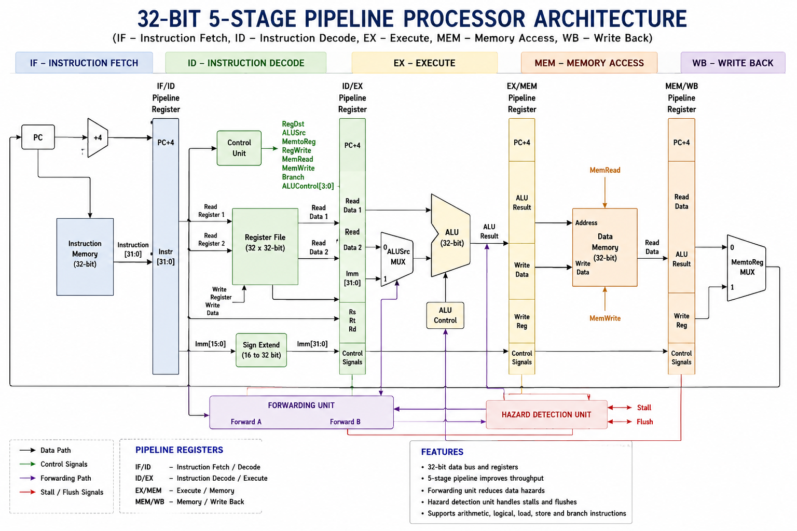
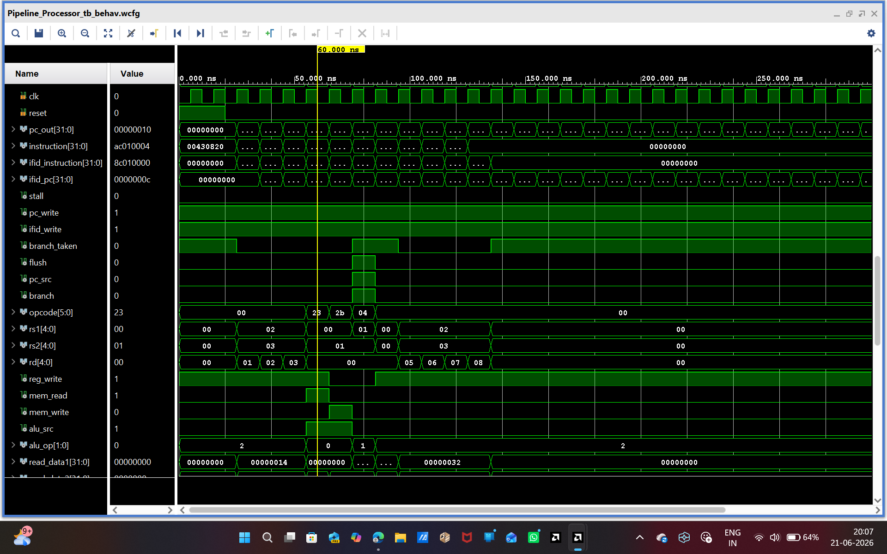
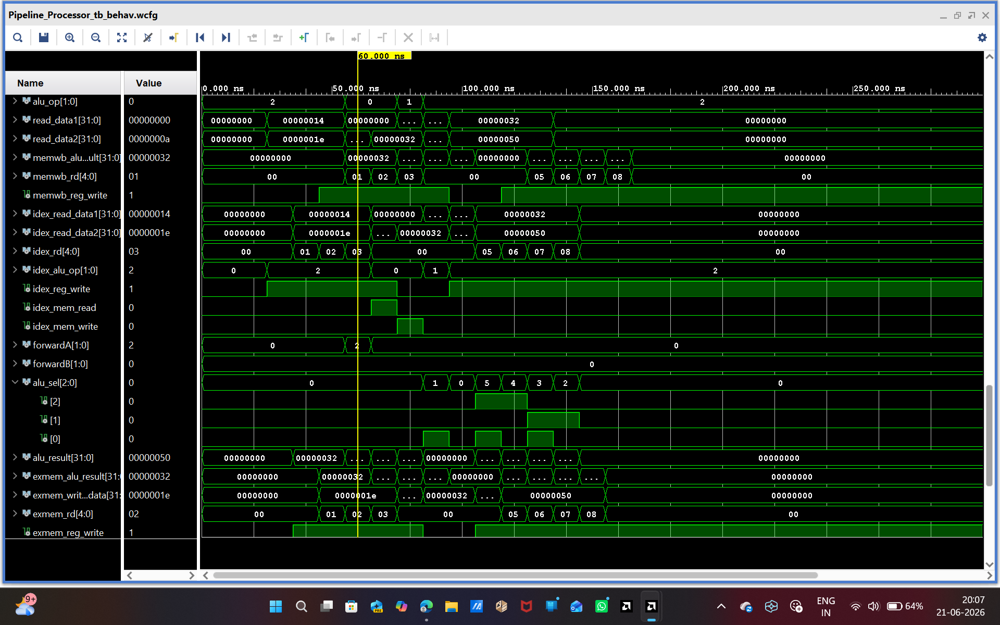
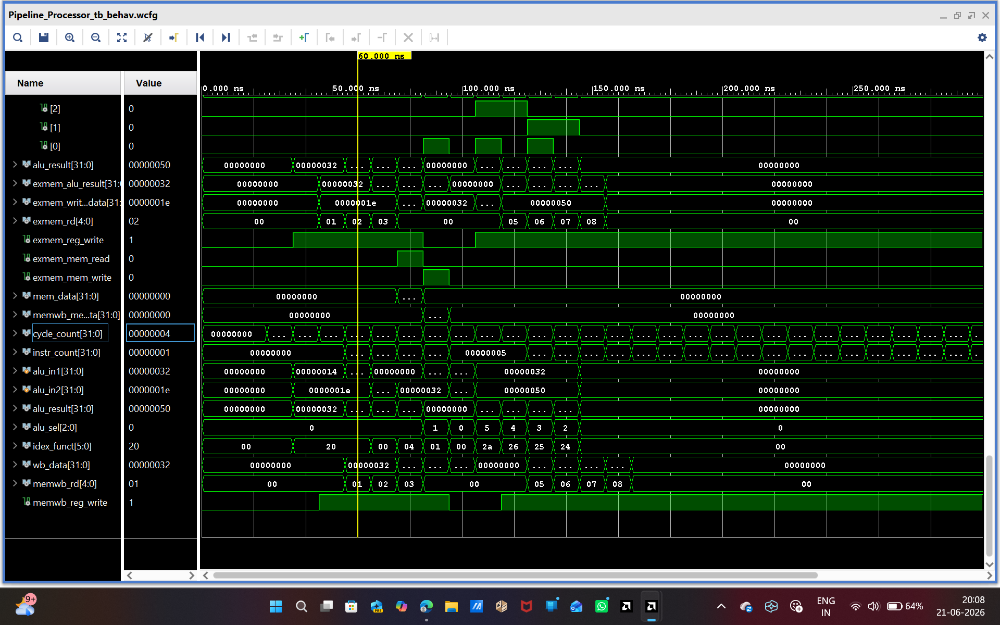
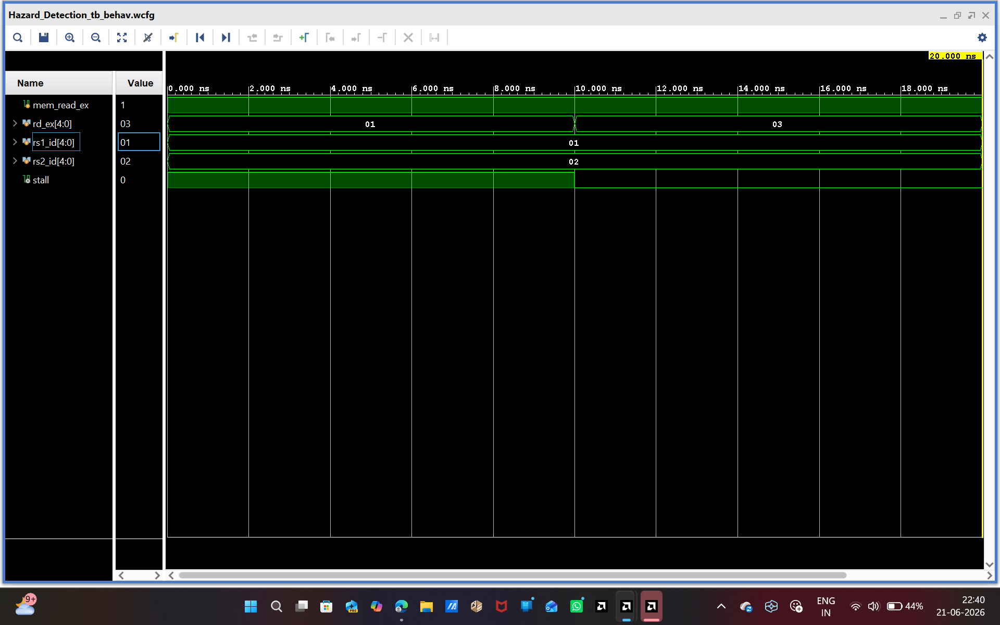
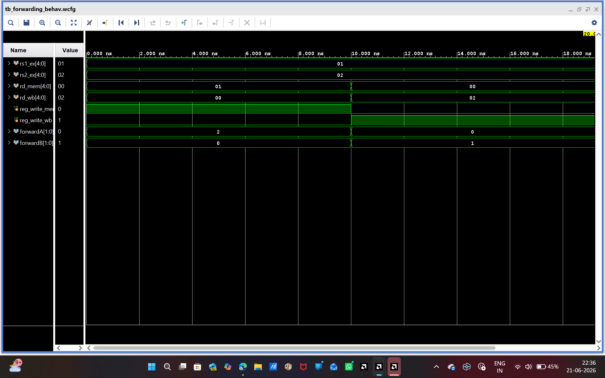

# 32-Bit 5-Stage Pipelined Processor Using Verilog HDL

## Overview

This project presents the design, implementation, and verification of a **32-Bit 5-Stage Pipelined Processor** developed using **Verilog HDL**. The processor improves execution throughput by dividing instruction execution into five pipeline stages and allowing multiple instructions to be processed concurrently.

To ensure correct execution and improve performance, the design incorporates:

* Pipeline Registers
* Forwarding Unit
* Hazard Detection Unit
* Branch Handling Logic
* Register File
* ALU Control Logic
* Data Memory Interface

The processor was designed and verified using **Xilinx Vivado Design Suite**, with RTL analysis and behavioral simulation performed to validate functionality.

---

# Key Features

✅ 32-Bit Processor Architecture

✅ 5-Stage Pipeline Datapath

✅ Verilog HDL Modular Design

✅ Pipeline Register Implementation

✅ Data Hazard Resolution using Forwarding

✅ Load-Use Hazard Detection and Stalling

✅ Branch Decision and Control Logic

✅ Register File Architecture

✅ Arithmetic Logic Unit (ALU)

✅ Instruction and Data Memory

✅ RTL Schematic Generation

✅ Behavioral Simulation and Verification

---

# Processor Pipeline Architecture

The processor follows a classic 5-stage pipeline:

| Stage | Description                        |
| ----- | ---------------------------------- |
| IF    | Instruction Fetch                  |
| ID    | Instruction Decode & Register Read |
| EX    | Execute / ALU Operations           |
| MEM   | Memory Access                      |
| WB    | Write Back                         |

### Pipeline Flow

```text
Instruction Fetch
        │
        ▼
Instruction Decode
        │
        ▼
Execute
        │
        ▼
Memory Access
        │
        ▼
Write Back
```

---

# Processor Block Diagram

<p align="center">    </p>

The architecture contains:

* Program Counter (PC)
* Instruction Memory
* Register File
* Control Unit
* ALU Control Unit
* ALU
* Data Memory
* Pipeline Registers
* Forwarding Unit
* Hazard Detection Unit
* Branch Comparator
* Branch Control Logic

---

# Implemented Modules

## Core Datapath Components

| Module               | Function                  |
| -------------------- | ------------------------- |
| PC.v                 | Program Counter           |
| Instruction_Memory.v | Instruction Storage       |
| register_file.v      | Register Storage          |
| control_unit.v       | Control Signal Generation |
| ALU_Control.v        | ALU Operation Selection   |
| aluu.v               | Arithmetic Logic Unit     |
| DataMemory.v         | Data Memory Access        |

---

## Pipeline Registers

| Module   | Function                   |
| -------- | -------------------------- |
| IF_ID.v  | IF → ID Pipeline Register  |
| ID_EX.v  | ID → EX Pipeline Register  |
| EX_MEM.v | EX → MEM Pipeline Register |
| MEM_WB.v | MEM → WB Pipeline Register |

---

## Hazard Management

| Module             | Function                 |
| ------------------ | ------------------------ |
| ForwardingUnit.v   | Resolves Data Hazards    |
| Hazard_Detection.v | Detects Load-Use Hazards |

---

## Branch Handling

| Module              | Function                    |
| ------------------- | --------------------------- |
| BranchControl.v     | Branch Control Logic        |
| Branch_Comparator.v | Branch Condition Evaluation |

---

## Top-Level Integration

```text
Pipeline_Processor.v
```

Integrates all processor modules into a complete pipelined architecture.

---

# Supported Instructions

## Arithmetic Operations

* ADD
* SUB
* AND
* OR
* XOR

## Memory Operations

* LOAD
* STORE

## Control Operations

* Branch Instructions

---

# Hazard Handling Mechanisms

## Forwarding Unit

The Forwarding Unit eliminates unnecessary stalls by forwarding ALU results directly from later pipeline stages to the Execute stage.

### Benefits

* Reduces data hazards
* Improves instruction throughput
* Minimizes pipeline stalls

---

## Hazard Detection Unit

The Hazard Detection Unit identifies load-use hazards that cannot be resolved through forwarding.

### Actions Performed

* Pipeline Stall
* Pipeline Flush
* Control Signal Management

---

# RTL Schematic

<p align="center">
  
</p>

RTL verification confirms successful integration of all pipeline stages and supporting modules.

---

# Simulation Results

Behavioral simulation was performed in Xilinx Vivado to validate processor functionality.

## Verified Functionalities

* Correct Instruction Fetch
* Correct Instruction Decode
* Register Read/Write Operations
* ALU Execution
* Pipeline Register Transfers
* Forwarding Logic
* Hazard Detection and Stalling
* Branch Execution
* Memory Read/Write Operations
* Write Back Operations

### Example Simulation Waveforms

<p align="center">    </p>

<p align="center">    </p>

<p align="center">    </p>

### Hazard Detection & Forwarding Verification

<p align="center">
   </p>

<p align="center">  </p>

Simulation confirms correct forwarding paths and hazard resolution mechanisms.

---

# How to Run

1. Open **Xilinx Vivado Design Suite**
2. Create a new Verilog Project
3. Add all source files from `Source_Code/`
4. Add testbench files from `Testbench/`
5. Set `Pipeline_Processor_tb.v` as the top simulation module
6. Run Behavioral Simulation
7. Analyze generated waveforms
8. Generate RTL Schematic for architecture verification

---

# Project Directory Structure

```text
32-bit-5-stage-pipelined-processor-verilog/
│
├── Source_Code/
├── Testbench/
├── Architecture/
├── RTL_Schematic/
├── Simulation_Results/
└── README.md
```

---

# Tools & Technologies

* Verilog HDL
* Xilinx Vivado Design Suite
* Vivado Simulator
* RTL Schematic Viewer
* Computer Architecture
* Digital Logic Design

---

# Learning Outcomes

This project provided practical experience in:

* Pipelined Processor Design
* Datapath Development
* Pipeline Register Design
* Hazard Detection Techniques
* Data Forwarding Mechanisms
* Branch Handling
* RTL Design Methodology
* Functional Verification
* Verilog HDL Development
* Computer Architecture Concepts

---

# Future Enhancements

* Complete RISC-V ISA Implementation
* Branch Prediction Unit
* Cache Memory Integration
* Multi-Level Memory Hierarchy
* Superscalar Execution
* Out-of-Order Scheduling
* FPGA Deployment
* Performance Benchmarking

---

# Author

**Bellam Udaya Sree**

B.Tech – Electronics & Communication Engineering

JNTUA College of Engineering, Ananthapuramu

### Connect With Me

GitHub:
https://github.com/udayasree-vlsi

LinkedIn:
https://www.linkedin.com/in/udaya-sree-4b00a1304

---

# Project Status

✅ Completed

✅ RTL Verified

✅ Behavioral Simulation Completed

✅ Hazard Detection Verified

✅ Forwarding Unit Verified

✅ Branch Logic Verified

✅ GitHub Published

🚀 Next Project: **32-Bit RISC-V Pipelined Processor**
